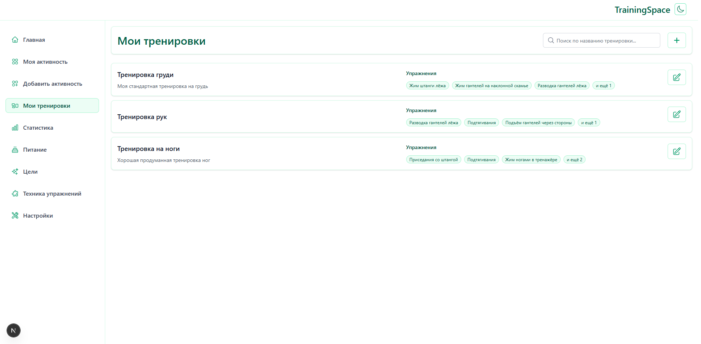
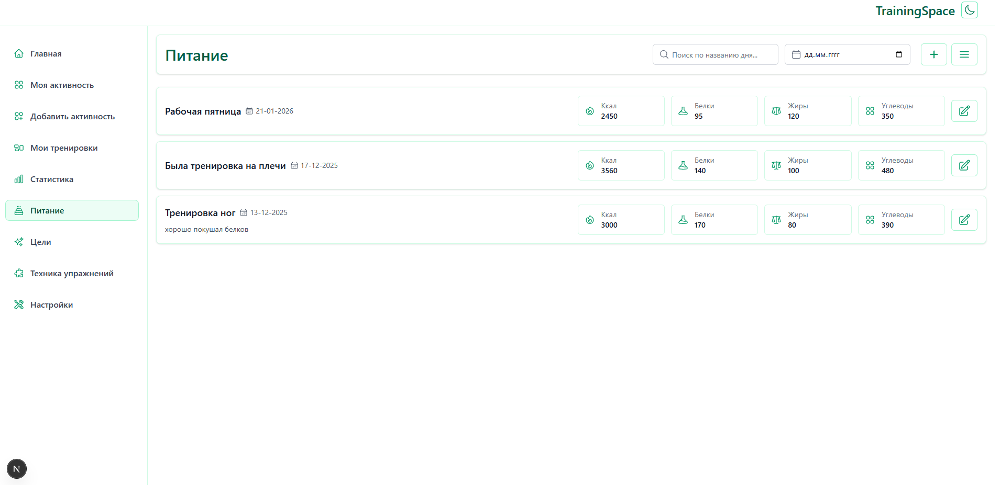
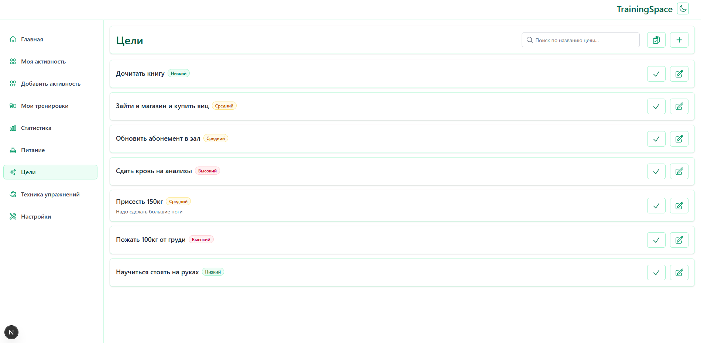
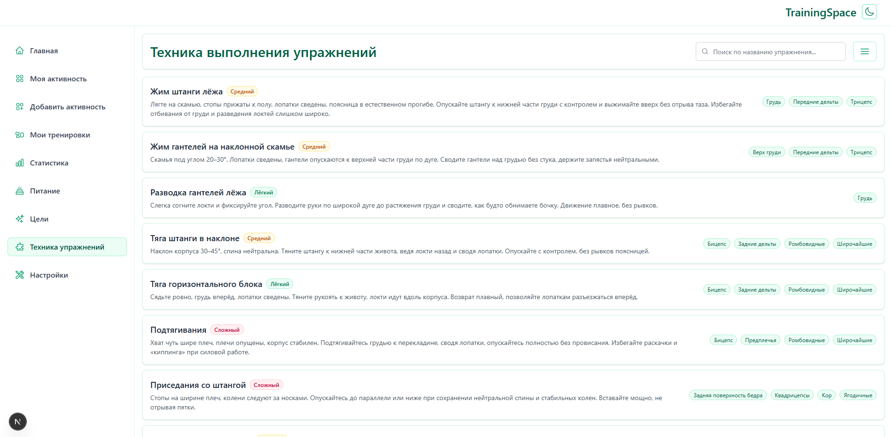

## TrainingSpace

**TrainingSpace** — это Open Source‑приложение для отслеживания тренировок, питания, активности и целей.  
Оно помогает вести более осознанный образ жизни: планировать тренировки, фиксировать прогресс и работать с целями в одном месте.


Ура, у нас релиз! Сейчас приложение находится в активной стадии тестирования и доработок.
В дальнейшем по мере нужды и возможности я буду добавлять новый функционал и фишки.

Последняя актуальная версия проекта **1.0.0** (Релиз)

URL: https://your-training.space

Репозиторий: https://github.com/wertas441/TrainingSpace

---

## Стек технологий

- **Frontend**
  - Next.js 16 (App Router)
  - React 19
  - TypeScript
  - Zustand
  - Tailwind CSS 4 + SCSS
  - Jest + Testing Library


- **Backend**
  - Node.js + Express 5
  - TypeScript
  - PostgreSQL


- **Прочее**
  - Docker / docker-compose для локального окружения
  - GitHub Actions - для CI/CD
---

## Основной функционал

- **Аутентификация и профиль**
  - Регистрация и вход в систему
  - Профиль пользователя с базовой информацией
  - Настройки: смена email, смена пароля


- **Тренировки**
  - Создание и редактирование тренировок
  - Добавление упражнений в тренировку
  - Просмотр списка своих тренировок


- **Активности**
  - Добавление и отслеживание активности (my-activity)
  - История активности


- **Питание**
  - Ведение дневников питания (nutrition days)
  - Просмотр списка дней и деталей по каждому дню


- **Цели**
  - Создание целей (goals)
  - Просмотр списка целей и деталей по каждой
  - Возможность отметить цель как выполненную и посмотреть список выполненных целей


- **Обзор и статистика**
  - Главная/dashboard
  - Страница статистики (`/stats`)

---

## Скриншоты

<details>
  <summary>Click</summary>









</details>


## Запуск проекта локально

Перед запуском убедитесь, что у вас установлены:

- Node.js (актуальная LTS‑версия)
- npm и yarn
- Docker

Рекомендуемая структура запуска:

1. Настроить и запустить `docker-compose.yml` файл через команду docker-compose up -d
2. Запустить **backend**
3. Запустить **frontend**

Ниже — инструкции подробнее.

---

## Backend

Код backend находится в папке `backend/`.

### 1. Установка зависимостей

```bash
cd backend
yarn install
```

### 2. Настройка окружения

Создайте файл `.env` в папке `backend` (рядом с `package.json`).  
Пример (подкорректируйте под свою БД и домены):

```env
PORT=3002
NODE_ENV=development
FRONTEND_URL=http://localhost:3000

DB_HOST=localhost
DB_PORT=5436
DB_NAME=training_space
DB_USER=your_db_user
DB_PASSWORD=your_db_password
DB_AUTO_INIT=true
DB_AUTO_SEED=false

JWT_SECRET=your-jwt-secret
```

### 3. Инициализация БД

В `backend/src/database` есть файлы для инициализации схемы и базовых данных:
- `schema.sql` — структура таблиц


- `init.ts`, `seedExercises.ts` — скрипты инициализации


### 4. Запуск в режиме разработки

```bash
cd backend
yarn dev
```

Backend по умолчанию будет слушать порт `3002` (или тот, что указан в `PORT`).

### 5. Сборка и продакшн‑запуск

```bash
cd backend
yarn build
yarn start
```

---
## Frontend

Код frontend находится в папке `frontend/`.

### 1. Установка зависимостей

Проект использует **yarn** (есть `yarn.lock` и в `package.json` указан `packageManager`).

```bash
cd frontend
yarn install
```

### 2. Переменные окружения 

Сейчас frontend обращается к backend вот по такой структуре:

```env
export const baseUrlForBackend: string = process.env.NEXT_PUBLIC_BACKEND_URL ?? 'http://localhost:3002';
```

Если вы хотите использовать свой домен, вы можете создать .env файл в корне frontend и использовать примерно такую структуру:

```env
NEXT_PUBLIC_BACKEND_URL=https://your-training.space
```

### 3. Запуск в режиме разработки

```bash
cd frontend
yarn dev
```

По умолчанию frontend поднимется на `http://localhost:3000`.

### 4. Сборка и продакшн‑запуск

```bash
cd frontend
yarn build
yarn start
```

### 5. Тесты

```bash
cd frontend
yarn test
```

---

## Структура репозитория

```text
backend/   # Backend API (Express + TypeScript + PostgreSQL)
frontend/  # Frontend (Next.js + React + TypeScript)
```

Подробнее о структуре вы можете посмотреть в:

- `backend/src` — конфиг, модели, роуты, типы и т.д.


- `frontend/src/app` — страницы и layout‑ы


- `frontend/src/components` — UI‑компоненты


- `frontend/src/lib` — контроллеры, утилиты, хуки

---

## Как использовать приложение

1. Зарегистрируйтесь или войдите в аккаунт.

2. Создавайте:
   - тренировки и активности,
   - дни питания,
   - цели.
3. Используйте страницы обзора и статистики, чтобы отслеживать прогресс.

---

## Контрибьюции

Проект открыт для идей и доработок:

- создавайте **Issues** на GitHub с багами и предложениями;
- отправляйте **Pull Request** с улучшениями кода, дизайна или документации.

Буду рад любому вкладу в развитие **TrainingSpace**.


