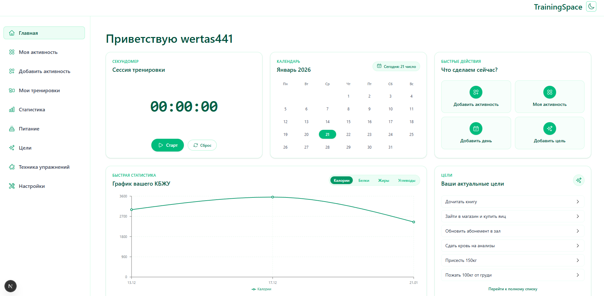
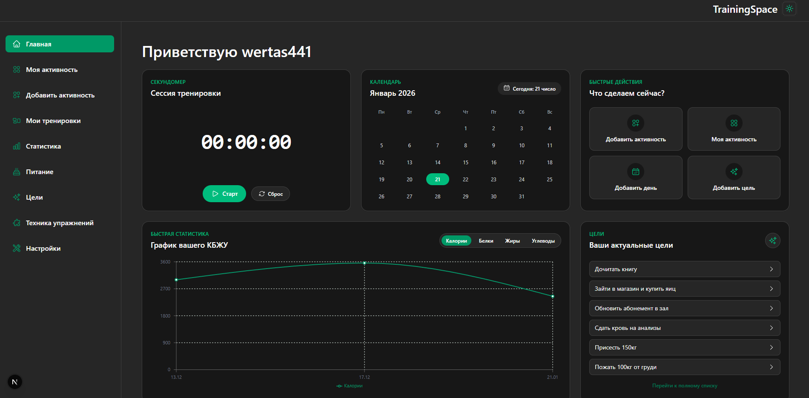
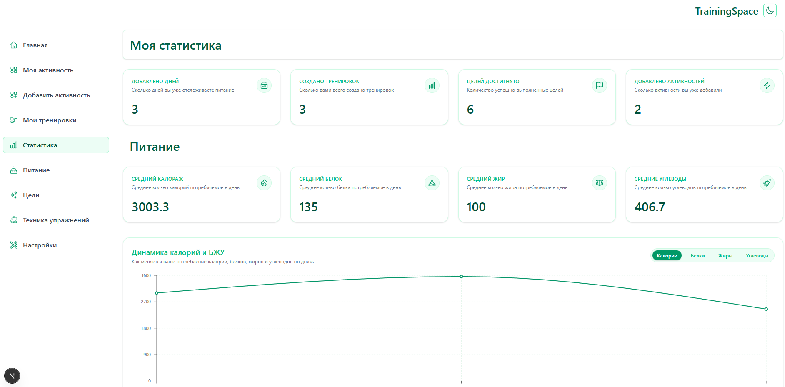
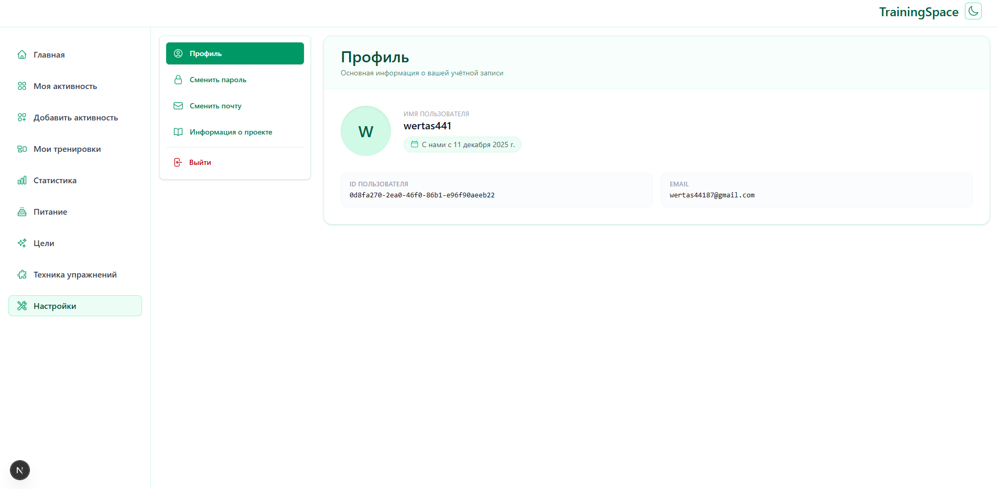

# Скриншоты TrainingSpace

В этом файле собраны скриншоты интерфейса по разделам приложения.

## Главная (Dashboard)

  
Открыть скриншоты главной страницы

## Тренировки

  
Открыть скриншоты раздела тренировок

## Статистика

  
Открыть скриншоты раздела статистики

## Питание

  
Открыть скриншоты раздела питания

## Цели

  
Открыть скриншоты раздела целей

## Упражнения

  
Открыть скриншоты раздела упражнений

## Профиль

  
Открыть скриншоты профиля

